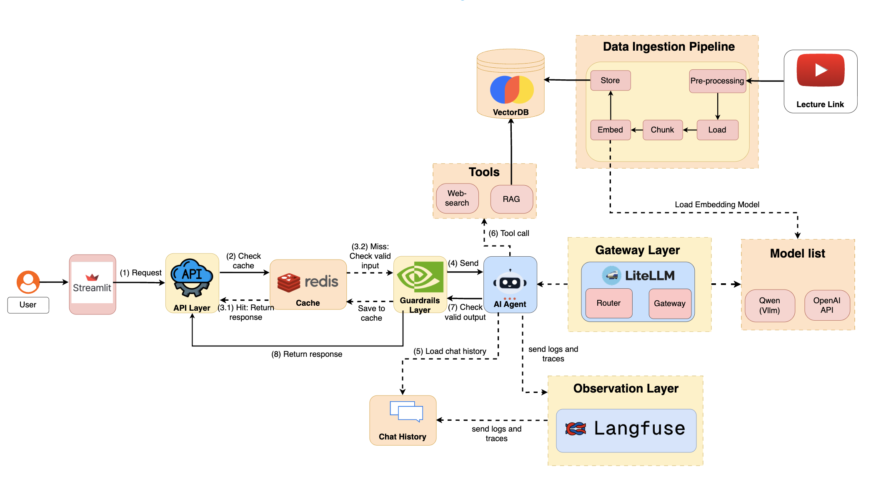

# Course Learning Assistant

## Table of contents

- [Introduction](#introduction)
- [System architecture](#system-architecture)
  - [API layer](#api-layer)
  - [Guardrails layer](#guardrails-layer)
  - [Gateway layer](#gateway-layer)
  - [Observation layer](#observation-layer)
  - [RAG (vector database)](#rag-vector-database)
  - [Cache](#cache)
- [Repository structure](#repository-structure)
- [Installation](#installation)
  - [Python environment with uv](#python-environment-with-uv)
  - [Infrastructure (Docker)](#infrastructure-docker)
  - [Environment configuration](#environment-configuration)
- [Running the stack](#running-the-stack)

## Introduction

AI, Machine Learning, and LLM courses are widely available on YouTube (e.g., Stanford courses). However, learning from long lecture videos is often inefficient and difficult to review. This project aims to transform raw video lectures into structured, searchable knowledge.

The main motivations of this project are:

- **Make long lecture videos easier to learn from**

  Many lectures are more than one hour long. It is hard for learners to quickly find the most important ideas. This project extracts the key discussions from each lecture.

- **Turn video content into structured learning materials**

  Instead of only watching videos, learners can read clear explanations that summarize the main concepts in the lecture.

- **Allow users to ask questions about the course content**

  The system provides an AI agent that can answer questions based on the lecture materials.

## System architecture



This system is not just a **standalone agent**; it is designed as a **production AI platform** with a layered architecture to ensure stability, efficiency, and reliability. 

- The API layer serves as the entry point for handling requests.
- Gateway layer manages routing and orchestration across services.
- Guardrails layer enforces safety, validation, and policy constraints on model outputs.
- Observation layer provides monitoring, logging, and tracing to maintain system transparency and performance. 
- Caching is integrated to optimize response time and reduce redundant computations.
- RAG (vector database) layer enables retrieval of relevant lecture materials to ground responses in accurate context.

Together, these layers form a robust foundation that allows agents to operate consistently and effectively in real-world environments.

### API layer

- **FastAPI** exposes stable HTTP endpoints (for example `/v1`) so any client can call the assistant the same way.
- The web layer stays **small**: it handles requests, streaming, and health checks; the heavy work lives in services.
- Shared setup (memory, orchestrator) runs **once** when the server starts, not on every request.

### Guardrails layer

- Uses **NVIDIA NeMo Guardrails** with YAML flows in `src/rails/` so rules and prompts live in config, not scattered in code.
- When guardrails answer a turn, the full agent path can be **skipped**, which saves time and API cost.
- **Example:** a toxic or self-harm style question can be **blocked or redirected** before it reaches the main agent.
- Guardrails can be **turned on per environment** via `app.state` when you deploy them.

### Gateway layer

- All LLM calls go through **LiteLLM** (`infra/infra-llmlite`), so the app always uses one familiar OpenAI-style URL.
- You can point the same code at **cloud APIs or local vLLM** by changing the gateway config, not the Python services.
- Rate limits and budgets can sit at the **proxy**, which protects spend when traffic spikes.

### Observation layer

- **Langfuse** records traces: what the user asked, which steps ran, and what the model returned.
- You can group traces by **user or session** to debug long chats in the Langfuse UI.
- Matches the self-hosted stack under `infra/infra-langfuse`.

### RAG (vector database)

- **Chroma** stores lecture chunks; **RetrievalService** fetches the best matches for a question.
- **CrewAI / LangChain tools** let the agent choose when to **look up** the course vs answer from general knowledge.
- New videos are processed through **Airflow** (`ingest_data/`) so the index stays up to date.

### Cache

- **Redis** holds short chat context and can cache **exact repeat questions** for a short TTL.
- **LiteLLM's semantic cache** can match **similar** questions (not only identical text) so near-duplicates reuse an answer.
- **Use cases:** Many students ask the same FAQ; most hits are served from cache instead of hitting the model every time.
- That keeps responses **faster** and bills **lower** at busy times.

## Repository structure

Folders are listed first, then main entrypoint files.

| Path | Description |
|------|-------------|
| `infra/infra-airflow/` | Docker Compose for Apache Airflow (lecture ingest pipeline) |
| `infra/infra-langfuse/` | Docker Compose for Langfuse, ChromaDB, and related services |
| `infra/infra-llmlite/` | Docker Compose for LiteLLM (OpenAI-compatible gateway to models) |
| `ingest_data/` | Airflow project directory: DAGs, plugins, and ingest configuration |
| `pages/` | Streamlit multipage apps (e.g., chatbot, summaries) |
| `reports/` | Generated lecture outputs (summaries, frames, etc.) |
| `src/` | FastAPI application: routers, services (agents, memory, retrieval), schemas, and settings |
| `transcript/` | Transcript-related assets |
| `test/` | Scripts and tests for local checks |
| `run.py` | Uvicorn entrypoint for the API |
| `Main_Page.py` | Streamlit home page (multipage app entry) |
| `streamlit_utils.py` | Shared helpers for the Streamlit UI |

## Installation

### Python environment with uv

1. Install [uv](https://docs.astral.sh/uv/getting-started/installation/) if it is not already installed.

2. From the project root, create the virtual environment, activate it, and install dependencies:

   ```bash
   uv venv && \
   source .venv/bin/activate && \
   uv sync --active
   ```

3. The project targets Python **3.10** (see `.python-version`).

### Infrastructure (Docker)

Several stacks expect a shared Docker network named `infra_network`. Create it once (ignore errors if it already exists):

```bash
docker network create infra_network
```

Then start the stacks you need (typically in this order so LiteLLM can reach Postgres on the same network):

1. **Langfuse stack** (`infra/infra-langfuse`): observability, ChromaDB, Postgres, Redis, and supporting services used by the rest of the project.

   ```bash
   cd infra/infra-langfuse
   docker compose up -d
   ```

2. **LiteLLM** (`infra/infra-llmlite`): OpenAI-compatible API on port **4000**, configured via `config.yaml` and env files in that folder.

   ```bash
   cd infra/infra-llmlite
   # Copy and edit secrets: cp .env.example .env
   docker compose up -d
   ```

3. **Airflow** (`infra/infra-airflow`): optional; used to run the lecture ingest DAGs. The provided `.env` sets `AIRFLOW_PROJ_DIR` to the repo’s `ingest_data` folder.

   ```bash
   cd infra/infra-airflow
   docker compose up -d
   ```

Refer to each `docker-compose.yaml` and any `README_*.md` files in the repo for service-specific ports and credentials.

### Environment configuration

1. At the **project root**, copy the example file and fill in your values:

   ```bash
   cp .env.example .env
   ```

2. `src/settings.py` loads `.env` from the repository root. Set at least:

   - `OPENAI_API_KEY` — must be present; for a local LiteLLM deployment this is often the same master key configured in LiteLLM (see `infra/infra-llmlite`).
   - `OPENAI_BASE_URL` — defaults to `http://localhost:4000` (LiteLLM).
   - Database and Redis settings if you are not using defaults (`POSTGRES_*`, `REDIS_*`).
   - Optional Langfuse keys: `LANGFUSE_PUBLIC_KEY`, `LANGFUSE_SECRET_KEY`, `LANGFUSE_HOST`.

3. Align Chroma and other keys with whatever you configured in `infra/infra-langfuse` if your app talks to those services.

## Running the stack

Run these in separate terminals when developing locally.

### 1. Start the API

From the project root:

```bash
uv run run.py
```

The FastAPI app listens on **8055** by default (`HOST` / `PORT` in settings). Health checks: `http://localhost:8055/health` and `http://localhost:8055/ready`.

### 2. Start a local model with vLLM (optional)

If you use a local OpenAI-compatible server (for example, the Qwen model wired through LiteLLM in `infra/infra-llmlite/config.yaml`), start vLLM on the host so LiteLLM can reach it (e.g., `host.docker.internal:8000` from containers):

```bash
vllm serve Qwen/Qwen3-4B-Instruct-2507 \
  --max-model-len 16384
```

Ensure LiteLLM’s `api_base` in `infra/infra-llmlite/config.yaml` matches where vLLM listens.

### 3. Start the Streamlit UI

From the project root:

```bash
uv run streamlit run Main_Page.py
```

The UI defaults the API base URL to `http://localhost:8055/v1`. You can override it with the environment variable `AIDE_API_BASE_URL` if needed.
